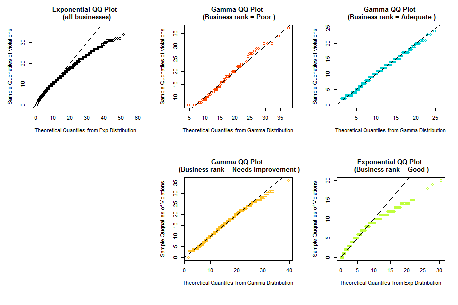

San Francisco Restaurants Inspection Analysis (2013 Q4 - 2016 Q4)
=============
author: Tif Pun | MSCIS | Boston University
date: Dec 9, 2016
autosize: true

<style>
body {
    overflow: scroll;
}
</style>

Data Understanding and Preparation
=============

**Basic understanding to the data:**
- The raw data contains about 53500 records, each represents an inspection with 16 attributes
    
- Most inspections carry a score, but some don't (e.g. new businesses)
- One or more violations might be cited in one inspection
- Every business (restaurant) gets inspected once or more within 2013 Q4 - 2016 Q4

**Data cleaning and enrichment:**
- Irrelevant fields were excluded
- Inspections without a score were excluded
- A `rank` field calculated from `inspection score` was added to the inspections table
- The inspections table was broken down by years into four sub-tables: `inspections.13, inspections.14, inspections.15, inspections.16`
- A "businesses" table was derived from the inspections table:
 - The businesses table summarizes inspection information **per business (restaurant)**
 - Fields were calculated and added to the table, including: `total inspection count, total violation count, mean score, mean rank`
 - Two time-related fields were added for comparing the change of performance: `rank from first inspection, rank from latest inspection`

Part 1 - Analyze Categorical and Numerical Data
=============

- The data was studied from four dimensions:

  ### Inspections, Violations, Businesses, Scores

- **Inspections:**
  - How many inspections were done?
  - How many inspections were done for businesses in each rank?
  - Does time of the year have any impact on number of inspections?
  - Results highlights:
  
  ```
  40822 inspections were done over the past three years
  ```
    

- **Violations:**
  - How likely is violation(s) cited during an inspections?
  - What's the break down of violations by risks and ranking?
  - What are the 10 most common types of violations in general, and by business ranking?
  - Results highlights:
  
  ```
  In average, each inspection results in 1.48 violations
  ```
  
  ```
  The maximum number of violations resulted in one single inspection is 14
  ```
   

- **Businesses:**
 - What's the break down of businesses by ranking?
 - How did the number of inspected businesses change over time?
 - Are businesses improving or not over time?
 - Results highlights:

  

- **Scores:**
 - Find out the descriptive statistics of scores from all inspections.
 - How are inspection scores, number of inspections, and number of violations related?
 - Results highlights:

  


Part 2 - Examine the distribution of the businesses' violation count
=============

The workflow of examining the dstribution of the `violation count` (numerical) variable is outlined below:

  1.  First, the five number summary was studied for businesses from each rank. Most graphs have a lot of outliers on the upper end

 

  2. To better reveal the pattern, a PDF histogram was created for each boxplot

 

  3. Graphs 1 and 5 seem to show an **Exponential distribution**, while others seem to show a **Gamma distribution**

  4. To confirm if this observation is correct, two goodness-of-fit tests were done:
     1. An Exponential/Gamma distribution curve was overlaid on each PDF histogram for visual comparison

     

     2. A QQ plot was created for each PD histogram to check how well the theoritical and actual distributions match

     

  5. Conclusions:
      1. Businesses in the Poor and Adequete ranks fit the Gamma distribution very well
      2. Businesses in the Needs Improvement rank weakly fits the Gamma distribution
      3. Businesses in the Good rank and businesses overall do not follow the exponential distribution

Part 3 - Draw random samples and show the applicability of Central Limit Theorem
=============

 1. In this part, 4 sets of samples were drawn using the **Simple random sampling without replacement** method

 2. Each set contains 1000 samples, while each sample contains `200, 360, 900, and 1700 inspection records respectively

 3. For each set of samples, their sample means were calculated and their density distributions were plotted

 

 4. Observations:

   1. The lines all seem to fit the normal distribution. The greater the sample size, the better it fits this distribution

   1. The means remain unchanged, the greater the sample size, the more compact the data is (i.e. the standard deviation decreases)

 5. A normal QQ plot was also created for each of the density distribution, the observation is similar: The greater the sample size, the better it fits the normal distribution

 

 TODO: analysis of data using other sampling methods

Part 4 - Compare confidence intervals of the means with different confidence levels
=============

- The `violation count` variable was examined

- At a lower confidence levels, the confidence intervals is narrower, more samples will have the population mean not included within the interval (i.e. The 80% graph has more red bars than the 90% graph)

  

- As the sample.size increases, more samples will have the population mean not included within the interval

   
